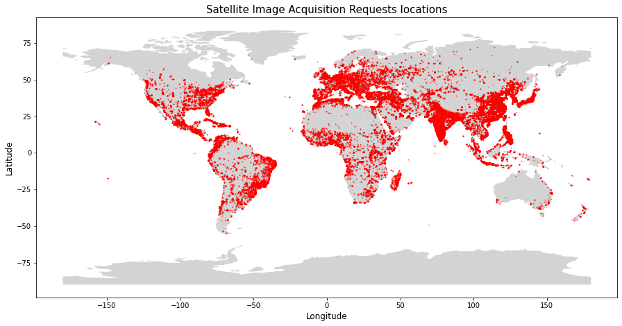

 # EOSpython
EOSpython is a set of python functions (intended to be a package) that encompases everything within a centralized Earth Observation Satellite scheduling system in terms of Scenario generation, pre-processing, problem setup, solution approach, decision maker preference integration, and visualization.

The DM preferences are introduced through a plethora of Scoring approaches available:
- modified ELECTRE-III (ordinal)
- topsis (ordinal)
- WSA (ordinal)

Note, all scoring approaches contain representative variables to elicited information as opposed to using pairwise evaluations.

And the solution procedure can be one of the following:
 - GLPK (Large scale LPP solver from cvxopt - does not require API)
 - ELPA (an extended longest path algorithm that can manage extremely large problem scenarios - does not require API)
 - gurobi (large scale LPP solver from gurobi - REQUIRES API)
 - PuLP (large scale LPP solver from PuLP - REQUIRES API)
 - Random greedy approach (can manage large scale problems, but performs very poorly - only really applicable to showcase complexity)

Note, some problem scnearios are too large for the LPP solvers to manage. 


The four main functions are EOSscenario(), EOSsolve(), EOSvisualize(), and EOSevaluate() - an explanation for the functions are given below. 

The package dependencies are:
- numpy, pandas, datetime, requests, random, ephem, math, folium (for a visual html map output), time, scipy, progressbar, ast, timeit, copy

and depending on whether a free optimization method is used (api may be required):
- cvxopt, gurobipy, pulp, docplex

Real satellite paths are introduced trough their TLE (Go to www.celestrak.com to obtain TLEs, default are Spot 6,7 and Pleiades A and B)
Also, there is an option to obtain realtime, historic, or generate weather data (cloud coverage) when generating the scenario, this does however require an API key from OpenWeatherMap.org. 

## Usage

### install 
```python
pip install EOSpython
```

### example
```python
from EOSpython import EOS
import pandas as pd                        #The evaluation output is presented as a pd dataframe
import numpy as np                         #The preference structure is given in numpy arrays

sat_TLEs = [38755, 40053]

               #w
criteria_w =  [0.05,      #area
               0.1,       #off-nadir angle
               0.1,       #sun elevation
               0.2,       #cloud coverage 
               0.2,       #priority
               0.1,       #price
               0.2,       #age
               0.05]      #uncertainty

       #q,  p,   v
qpv = [[0,  30,  1000],        #area
       [0,  2,   40],          #off-nadir angle
       [0,  10,  40],          #sun elevation
       [0,  2,   15],          #cloud coverage 
       [0,  1,   4],           #priority
       [0,  100, 20000],       #price
       [0,  4,   10],          #age
       [0,  0.5,   1]]         #uncertainty

x_data = EOS.scenario(seconds_gran=10, number_of_requests_0=1000, 
                      NORAD_ids=sat_TLEs, weather_real = False)
x_res1 = EOS.solve(x_data, scoring_method=2, solution_method = "DAG",  
                   criteria_weights = criteria_w, 
                   threshold_parameters= qpv)

EOS.visualize(x_data, x_res1, 'EOS_example')

df = EOS.evaluate(x_data, x_res1)

print(df.solution)
print(df.scenario)
```

## EOS.scenario() 
Generates the problem, so it functions as a general pre-processing for the EOS system. 
It is seeded so problem scenarios can be replicated across different environments and therefore utilized for evaluating different solution approaches.
Note, it isnt optimized for speed yet, so it will run rather slow.


It takes in the following arguments: 
- seconds_gran = 20 %The discretisation level of the satellitel path (discrete optimization problem) 
- number_of_requests_0 = 1000, %customer requests in database initially (there is an option to contionously add customers to mimic the effect of a real EOS production where new customers are entering and one over time still wants to ensure that requests doesnt violate an age threshold. The customers are generated based on location distribution which is higher around urbanized areas - this should mimic the actual customer database that EOS companies see or at least mimic the density of requests that optimization problems face.) 
- NORAD_ids a list of the chosen satellite TLEs. Default is [38755, 40053]  %TLEs for spot 6 and 7 satellites
- weather_real = False, %whether real cloud coverage data is utilized for the chosen time horizon
- simplify = False, #whether constraints are simplified based on the principle of inter set constraints - IT IS ONLY VALID IF a LPP solution approach is used s.a. GLPK.
- schedule_start is time of initiation for the schedule horizon. A list of the date entities expressing [year, month, day, hour, minute]. The default is [2021,7,21,9,40].
- hours_horizon = 8, %duration of planning horizon in hours
- max_off_nadir_angle = 30, %degrees that satellite can maneuver (or is allowed to still acquire pictures) 
- height_satellite = 694,   %altitude of satellites (in km) - this is in next iteration updated to automatically be calculated 
- rotation_speed = 30/12, %degrees per second - per https://directory.eoportal.org/web/eoportal/satellite-missions/s/spot-6-7
- cam_resolution = 1, %m^2 per pixel
- capacity_limit = 1000000, %in mega byte
- satellite_swath = 3600, &swath of satellite images 
- map_generation = True %whether a visualisation should be generated
- API_key = list of strings with API key(s) for OpenWeatherMap.org for weather forecasts and for historic api.weatherbit.io

Note, the scenarios consist of requests with stereo, strip requirements, which is modeled by the constraints. 
For a request to be considered we have defined certain thresholds, namely a maximum cloud coverage of 50 pct, 

AND outputs the following:
 - multi_sat_data.LPP is the Linear programming problem Ax<=b where LPP contains:
   - LPP.LHS - A in the Ax<b
   - LPP.RHS - b in the Ax<b
   - LPP.eLHS - A in the Ax=b
   - LPP.eRHS - b in the Ax=b
 - multi_sat_data.df is the data frame containing all information for the entire problem scenario (for each attempt)
 - multi_sat_data.pf_df is the performance data frame for the relevant (reachable) image attempts
 - multi_sat_data.m is the folium map with relevant problem scenario information

Two html map objects will be saved in your working directory for inspection, all_requests.html and sat_path.html, respectively. (THIS FEATURE SHOULD MAYBE BE REMOVED?)

## EOS.solve() 
This function contains both the preference integration part (scoring) and the solution approach.
It takes in the following arguments:
- scoring_method (can be 1 = TOPSIS, 2 = ELECTRE, 3 = naive scoring method WSA)
- solution_method (can be "gurobi", "PuLP", "cplex", "VNS", "random", or "DAG"). Note, for LPP approaches s.a.GLPK, the simplify argument in EOS.scenario() must be FALSE to not create for setwise acquisition constraints. That is, in the maneuvarability constraint to allow for the scenario where x1 cannot be acquired with x2 and x3, but x2 and x3 can be acquired together.
- criteria_weights (relevant for TOPSIS, ELECTRE, and WSA, e.g. [1,0,1,0,0,0,1,1,1])
- threshold_parameters (relevant for ELECTRE, e.g. [[0,0,1000],[0,0,40],[0,0,40],[0,0,15],[0,0,4],[0,0,20000],[0,0,1], [0,0,1]]). Note, it is the indifference, preference, and veto threshold variables assigned for each criteria.
- alpha a scalar, it is the factor with which scores are taken to the power of. It basically represent the level with which one trusts the computed score - it supplies the DM with ratio evaluation ability. Default value is 1 meaning this is negleted.
- API_key = string of API key for solvers (if they are necessary s.a.for CPLEX.

Note, the order with which criteria are presented in the criteria weights and threshold_parameters arguments are:
- area, 
- angle, 
- sun elevation, 
- cloud cover, 
- priority, 
- price, 
- age, 
- uncertainty

AND outputs the following:
 - multi_sat_testing.x is the binary solution vector illustrating which attempts should be acquired and which should be neglected
 - multi_sat_testing.score is the generated score for each attempt through the introduced preference setting
 - multi_sat_testing.time is the runtime for the solution approach

## EOS.visualize()
This funciton puts out an html file in the designated folder containing a folium map of the problem instance and the solution obtained.
It takes in the following arguments:
 - x_data which is the resulting output from the multi_sat_data() function
 - x_res which is the resulting output from the multi_sat_testing() function
 - name_of_html takes in a string for the name of the html file. Default is 'EOSpython'

The Output is a saved file in the working folder. 

Note, the visualize builds on the map, which is build in the scenario generation function multi_sat_data(). 
It is not possible to either build a deep copy of the html file or sequentially add feature groups in the folium package and it is therefore not possible sequentially run multiple different solution schemes without the former computed solution still being visible in the map - The capabiolity of changing the color on the acquisition in multi_sat_testing() is therefore added. Note, this is hopefully being improved for next update.

## EOS.evaluate()
This function provides a quick deeper evaluation functionality (than the total score and number of acquisitions provided in the sat_testing() function). The metrics that is showcased are respectively:
 - scenario specific metrics:
   - number of attempts
   - number of unique requests
   - number of constraints in the LPP
   - average angle on attempts
   - average prices 
   - average sun elevation (is more interesting for non-global scenarios)
   - average cloud cover 
   - average priority

 - Solution specific metrics
  - total acquisiitons
  - total profit
  - average cloud coverage
  - acqusitions with good cloud cover (<10)
  - acqusitions with bad cloud cover (>30)
  - average depointing angle
  - acquisitions with good off-nadir angle (<10)
  - acqusitions with bad off-nadir angle (>30)
  - average priority
  - priority 1 acquisitions
  - priority 2 acquisitions
  - priority 3 acquisitions
  - priority 4 acquisitions
  - average sun elevation
  - total area captured

OUTPUT: They can be accesed thrugh the evaluate.scenario and evaluate.solution output, respectively.

Note, average is often a bad metric in this case, as a few very bad performing acquisitions can hide behind a larger set of requests. A better metric is therefore to look at quantiles or certain benchmarks and how many acquisitions with that profile was able to be captured.

## Improvements or suggestions
### PLEASE let me know if you have any suggestions (good or bad) to the code - any comments are highly appreciated :-) In terms of added capabilities, I am currently considering:
 - allowing integration of user specified customer database
 - integrate a larger plethora of solution approaches:
    - NSGA-II
    - NSGA-III
    - other greedy approaches?
 - added visualization traits
 - added evaluation metrics
 - allow usage of evaluation approaches outside of main functions, e.g. for usage in weight and threshold value elicitation
 - improve visualization to e.g. showcase operational criteria also (cloud cover, sun elevation)

Again, if any of these have your interest, please reach out!


# Appendix
In this section, some of the assumptions of the pre-processing is explained.
the distribution of the request database is mainly landbased requests, as these mimic the high and low concentration areas that can occur in an EOS setting, and in the scheduling we are (more or less) only interested in the high distribution areas - as of why the marine requests are omitted. The database is created based on the population density of the earth, and assumes therefore that EOS imagery requests mimic the same density map. See the below figure for one instance:



In the event that the OWM api keys (and the corresponding subscription to gain access to enough weather data acquitions) are not acquired, then the free option of generating cloud cover observations can be utilised in the weather_real=False argument of the multi_sat_data() functionality. This cloud cover generation generates cloud cover data based on a three level cos function. This is done due to the locality and temporal considerations that apply to the cloud cover of image requests. The output mimics some of the landbased cloud cover metrics that are presented on the NASA cloud report (https://earthobservatory.nasa.gov/images/85843/cloudy-earth), where e.g. 30 pct are close to cloud free observations and a third has to be disregarded due to more than 50 pct cloud coverge. The distribution can be seen below.

     
