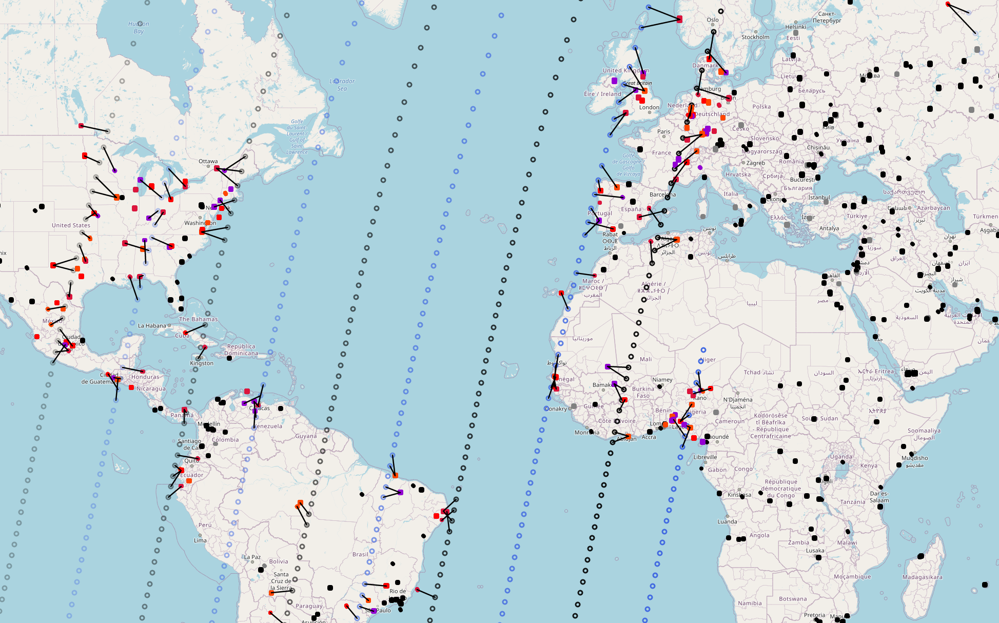

 # EOS
EOS is a set of functions (intended to be a package) that encompases everything within a centralized Earth Observation Satellite scheduling system in terms of Scenario generation, pre-processing, problem setup, solution approach, decision maker preference integration, and visualization.

The DM preferences are introduced through a plethora of Scoring approaches available:
- modified ELECTRE-III (ordinal)
- topsis (ordinal)
- WSA (ordinal)
all scoring approaches contain representative variables to elicited information as opposed to using pairwise evaluations.



the three main functions are multi_sat_data(), multi_sat_testing(), and visualize(). 

the package dependencies are:
- numpy, pandas, datetime, requests, random, ephem, math, folium (for a visual html map output), time, scipy, progressbar, ast, timeit, copy

and depending on whether a free optimization method is used (api may be required):
- cvxopt, gurobipy, pulp, docplex

Real satellite paths are introduced trough their TLE (Go to www.celestrak.com to obtain TLEs, default are Spot 6,7 and Pleiades A and B)
Also, there is an option to obtain realtime, historic, or generate weather data (cloud coverage) when generating the scenario. 

## Usage

### install 
```python
pip install EOSpython
```

### example
```python
import EOSpython
x_data = multi_sat_data(seconds_gran=10, number_of_requests_0=1000, 
                        NORAD_ids=[38755, 40053], weather_real = False)
x_res1 = multi_sat_testing(scoring_method=2, solution_method = "DAG", 
                           LPP = x_data.LPP, DF_i = x_data.df, performance_df = x_data.pf_df, 
                           criteria_weights = np.array([0,0,0,0,0,0,1,0]), 
                           threshold_parameters= np.array([[0,0,1000],[0,0,40],[0,0,40],[0,0,15],[0,0,4],[0,0,20000],[0,0,1], [0,0,1]]))
visualize(x_data, x_res1, 'EOS_example')
```

## multi_sat_data() 
Generates the problem, so it functions as a general pre-processing for the EOS system. 
It is seeded so problem scenarios can be replicated across different environments and therefore utilized for evaluating different solution approaches.
Note, it isnt optimized for speed yet, so it will run rather slow.

It takes in the following arguments: 
- seconds_gran = 20 %The discretisation level of the satellitel path (discrete optimization problem) 
- number_of_requests_0 = 1000, %customer requests in database initially (there is an option to contionously add customers to mimic the effect of a real EOS production where new customers are entering and one over time still wants to ensure that requests doesnt violate an age threshold) 
- NORAD_ids a list of the chosen satellite TLEs. Default is [38755, 40053]  %TLEs for spot 6 and 7 satellites
- weather_real = False, %whether real cloud coverage data is utilized for the chosen time horizon
- simplify = False, #whether constraints are simplified based on the principle of inter set constraints - IT IS ONLY VALID IF a LPP solution approach is used.
- schedule_start is time of initiation for the schedule horizon. A list of the date entities expressing [year, month, day, hour, minute]. The default is [2021,7,21,9,40].
- hours_horizon = 8, %duration of planning horizon in hours
- max_off_nadir_angle = 30, %degrees that satellite can maneuver (or is allowed to still acquire pictures) 
- height_satellite = 694,   %altitude of satellites (in km) - this is in next iteration updated to automatically be calculated 
- rotation_speed = 30/12, %degrees per second - per https://directory.eoportal.org/web/eoportal/satellite-missions/s/spot-6-7
- cam_resolution = 1, %m^2 per pixel
- capacity_limit = 1000000, %in mega byte
- satellite_swath = 3600, &swath of satellite images 
- map_generation = True %whether a visualisation should be generated

AND outputs the following:
 - multi_sat_data.LPP is the Linear programming problem Ax<=b where LPP contains:
   - LPP.LHS - A in the Ax<b
   - LPP.RHS - b in the Ax<b
   - LPP.eLHS - A in the Ax=b
   - LPP.eRHS - b in the Ax=b
 - multi_sat_data.df is the data frame containing all information for the entire problem scenario (for each attempt)
 - multi_sat_data.pf_df is the performance data frame for the relevant (reachable) image attempts
 - multi_sat_data.m is the folium map with relevant problem scenario information

## multi_sat_testing() 
This function contains both the preference integration part (scoring) and the solution approach.
It takes in the following arguments:
- scoring_method (can be 1 = TOPSIS, 2 = ELECTRE, 3 = naive scoring method WSA)
- solution_method (can be "gurobi", "PuLP", "cplex", or "DAG")  
- criteria_weights (relevant for TOPSIS, ELECTRE, and WSA), e.g. np.array([1,0,1,0,0,0,1,1,1])
- threshold_parameters (relevant for ELECTRE), e.g. np.array([[0,0,1000],[0,0,40],[0,0,40],[0,0,15],[0,0,4],[0,0,20000],[0,0,1], [0,0,1]]) Note, it is the indifference, preference, and veto threshold variables assigned for each criteria.
- alpha a scalar, it is the factor with which scores are taken to the power of. It basically represent the level with which one trusts the computed score - it supplies the DM with ratio evaluation ability. Default value is 1 meaning this is negleted.

Note, the order with which criteria are presented in the criteria weights and threshold_parameters arguments are:
- area, 
- angle, 
- sun elevation, 
- cloud cover, 
- priority, 
- price, 
- age, 
- uncertainty

AND outputs the following:
 - multi_sat_testing.x is the binary solution vector illustrating which attempts should be acquired and which should be neglected
 - multi_sat_testing.score is the generated score for each attempt through the introduced preference setting
 - multi_sat_testing.time is the runtime for the solution approach

## visualize()
This funciton puts out an html file in the designated folder containing a folium map of the problem instance and the solution obtained.
It takes in the following arguments:
 - x_data which is the resulting output from the multi_sat_data() function
 - x_res which is the resulting output from the multi_sat_testing() function
 - name_of_html takes in a string for the name of the html file. Default is 'EOSpython'

The Output is a saved file in the working folder. 

Note, the visualize builds on the map, which is build in the scenario generation function multi_sat_data(). 
It makes a deep copy of the html and is therefore possible to run for multiple different solution schemes.


### PLEASE let me know if you have any suggestions (good or bad) to the code - any comments are highly appreciated :-) 
